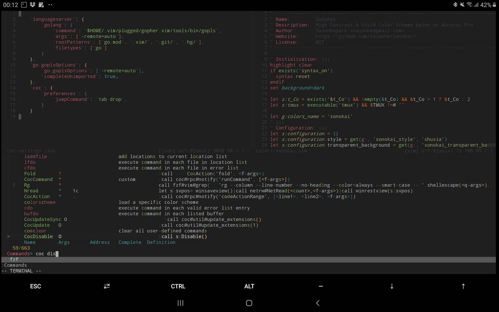

### Immutable development image

This image serves the purpose of documenting my default environment.

Quick run
`$ docker run --rm -it --entrypoint /asuser.sh -e UID=$(id -u) -e USER=$(id -un) -e GID=$(id -g) -e GROUP=$(id -gn) mgnsk/dev-env /bin/bash`

All plugins and tools are version-locked.

#### Screenshot

Running on Termux:

#### Entrypoint

The `/asuser.sh` entrypoint creates a user and runs as it.

`earlyoom` is started on each bash session.
Build and run:

`$ tusk build`

`$ tusk bash`
 
 To download/update image, run:

`$ tusk clean`

`$ tusk bash`

